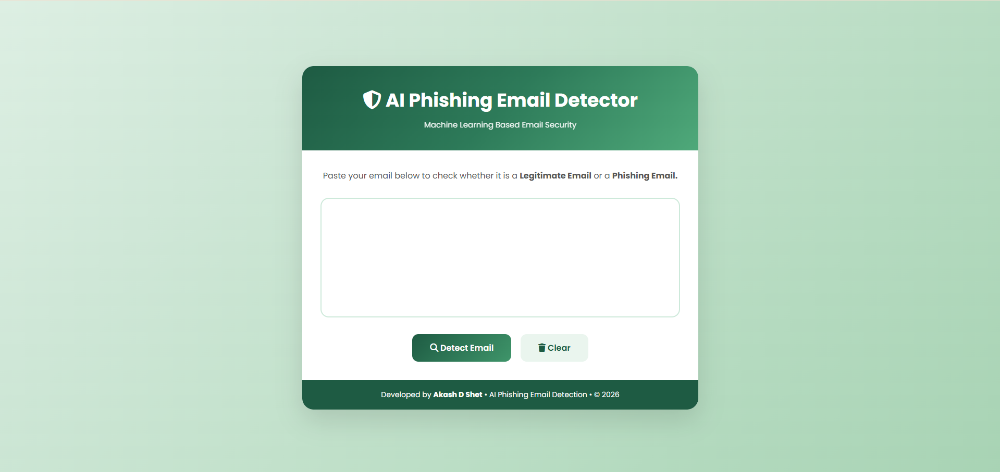
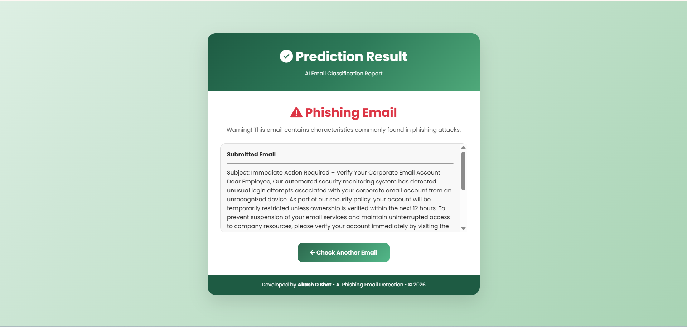
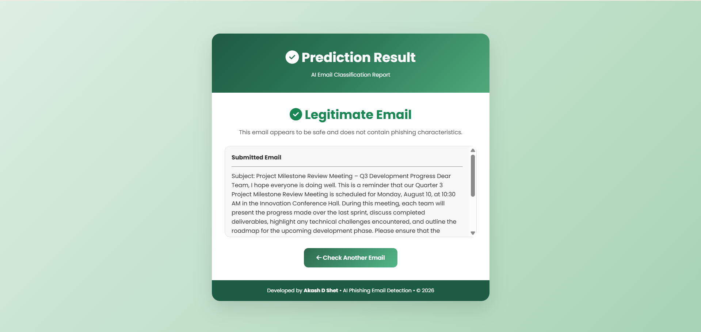
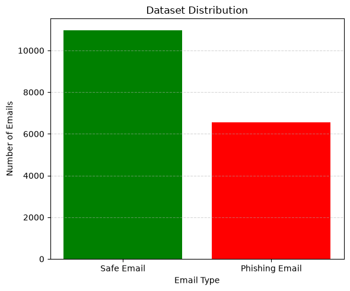
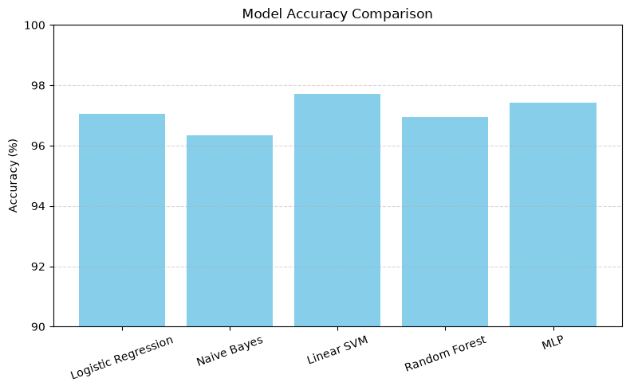
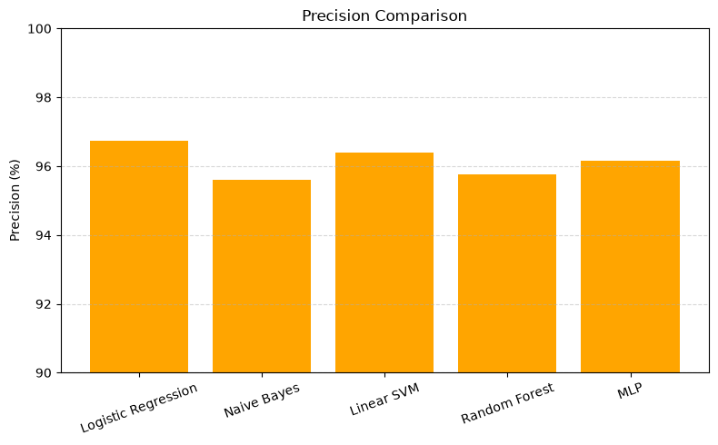
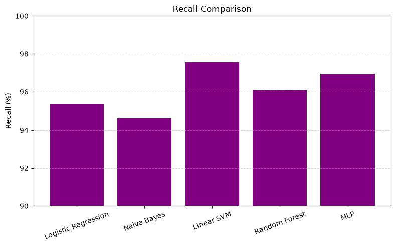
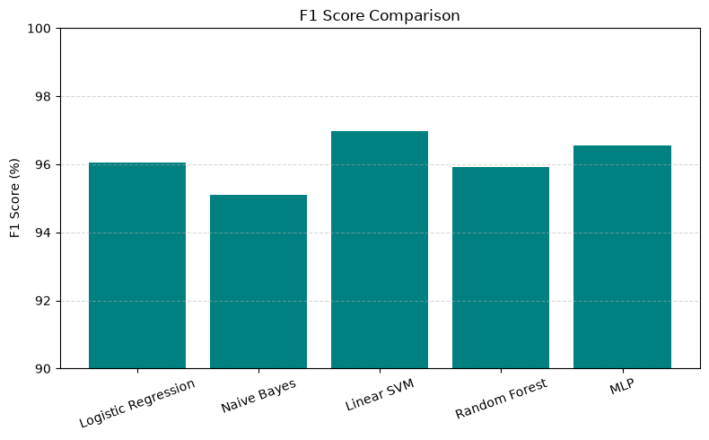
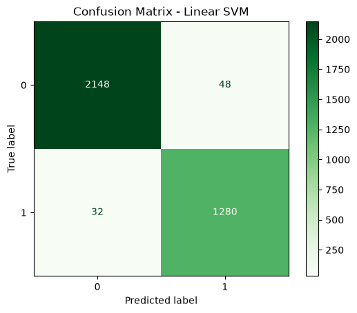

<div align="center">

# 🛡️ AI Phishing Email Detection System

### Detect Phishing Emails using Machine Learning & Natural Language Processing

A Flask-based web application that classifies emails as **Legitimate** or **Phishing** using Machine Learning, TF-IDF Vectorization, and Natural Language Processing (NLP).

🌐 **Live Demo:** https://ai-phishing-email-detection-4hki.onrender.com

</div>

---

# 📑 Table of Contents

- Project Overview
- Live Demo
- Features
- Application Screenshots
- Tech Stack
- Machine Learning Workflow
- Dataset
- Models Used
- Performance Analysis
- Project Structure
- Installation Guide
- Future Enhancements
- Author
- License

---

# 📌 Project Overview

Phishing emails are one of the most common cyber threats, often used to steal sensitive information such as passwords, banking credentials, and personal data.

This project presents an intelligent **AI-based Phishing Email Detection System** that automatically classifies emails as **Legitimate** or **Phishing** using **Natural Language Processing (NLP)** and **Machine Learning**.

The application preprocesses email text, extracts meaningful features using **TF-IDF Vectorization**, and predicts the email category using a trained Machine Learning model.

---

# 🚀 Live Demo

### 🌐 Website

https://ai-phishing-email-detection-4hki.onrender.com

---

# ✨ Features

- 🔍 Detects phishing emails instantly
- 🤖 Machine Learning based prediction
- 🧠 Natural Language Processing
- 📄 TF-IDF Feature Extraction
- ⚡ Fast prediction
- 🌐 Responsive Flask Web Application
- 🎨 Modern User Interface
- ☁️ Deployed on Render

---

# 📷 Application Screenshots

## 🏠 Home Page



---

## 🚨 Phishing Email Prediction



---

## ✅ Legitimate Email Prediction



---

# 🛠️ Tech Stack

## Programming Language

- Python

## Machine Learning

- Scikit-Learn

## Natural Language Processing

- NLTK

## Feature Extraction

- TF-IDF Vectorizer

## Backend

- Flask

## Frontend

- HTML5
- CSS3

## Libraries

- Pandas
- NumPy
- Joblib
- Regex

## Deployment

- Render

---

# ⚙️ Machine Learning Workflow

```text
                    Raw Email Dataset
                           │
                           ▼
                  Text Preprocessing
                           │
      ┌─────────────────────────────────┐
      │ • Lowercase Conversion          │
      │ • Remove URLs                   │
      │ • Remove Email IDs              │
      │ • Remove Numbers                │
      │ • Remove Punctuation            │
      │ • Stopword Removal              │
      │ • Lemmatization                 │
      └─────────────────────────────────┘
                           │
                           ▼
                TF-IDF Feature Extraction
                           │
                           ▼
                 Machine Learning Model
                           │
                           ▼
             Legitimate / Phishing Prediction
```

---

# 📂 Dataset

The dataset consists of phishing and legitimate email samples used to train and evaluate the Machine Learning models.

### Dataset Files

- 📄 Raw Dataset
- 📄 Cleaned Dataset

---

# 🤖 Machine Learning Models Evaluated

The following classification algorithms were trained and compared:

- Logistic Regression
- Multinomial Naive Bayes
- Linear Support Vector Machine (Linear SVM)
- Random Forest Classifier

The best-performing model was selected and deployed in the web application.

---

# 📊 Performance Analysis

## Dataset Distribution



---

## Accuracy Comparison



---

## Precision Comparison



---

## Recall Comparison



---

## F1 Score Comparison



---

## Confusion Matrix



---

# 📁 Project Structure

```text
AI_Phishing_Email_Detection
│
├── dataset
│   ├── Phishing_Email.csv
│   └── cleaned_dataset.csv
│
├── model
│   ├── phishing_model.pkl
│   └── tfidf_vectorizer.pkl
│
├── notebooks
│   └── phishing_email_detection_final.ipynb
│
├── static
│   ├── css
│   │     └── style.css
│   │
│   └── images
│         ├── home_page.png
│         ├── phishing_result.png
│         ├── legitimate_result.png
│         ├── dataset_distribution.png
│         ├── accuracy_comparison.png
│         ├── precision_comparison.png
│         ├── recall_comparison.png
│         ├── f1_score_comparison.png
│         └── confusion_matrix.png
│
├── templates
│   ├── index.html
│   └── result.html
│
├── app.py
├── requirements.txt
├── Procfile
├── README.md
└── LICENSE
```

---

# 💻 Installation Guide

### 1️⃣ Clone the Repository

```bash
git clone https://github.com/akashdshet16-dev/AI_Phishing_Email_Detection.git
```

---

### 2️⃣ Navigate to the Project Folder

```bash
cd AI_Phishing_Email_Detection
```

---

### 3️⃣ Install Dependencies

```bash
pip install -r requirements.txt
```

---

### 4️⃣ Run the Flask Application

```bash
python app.py
```

---

### 5️⃣ Open in Browser

```
http://127.0.0.1:5000
```

---

# 📈 Results

The deployed model accurately classifies email content into **Legitimate** and **Phishing** categories using NLP preprocessing and TF-IDF feature extraction.

Comparative evaluation across multiple Machine Learning algorithms demonstrated strong performance, enabling the selection of the most effective classifier for deployment.

---

# 🚀 Future Enhancements

- 📧 Real-time Email Monitoring
- 🔗 URL Reputation Analysis
- 📎 Attachment Malware Detection
- 🧠 Deep Learning Models (LSTM/BERT)
- 🌐 Browser Extension
- 📱 Mobile Application
- 📊 Explainable AI Predictions
- ☁️ Cloud Database Integration

---

# 👨‍💻 Author

## **Akash D Shet**

**GitHub**

https://github.com/akashdshet16-dev

---

# 🙏 Acknowledgements

Special thanks to the open-source community and the developers of Flask, Scikit-Learn, NLTK, and other libraries that made this project possible.

---

# 📄 License

This project is licensed under the **MIT License**.

Feel free to use, modify, and distribute this project under the terms of the MIT License.